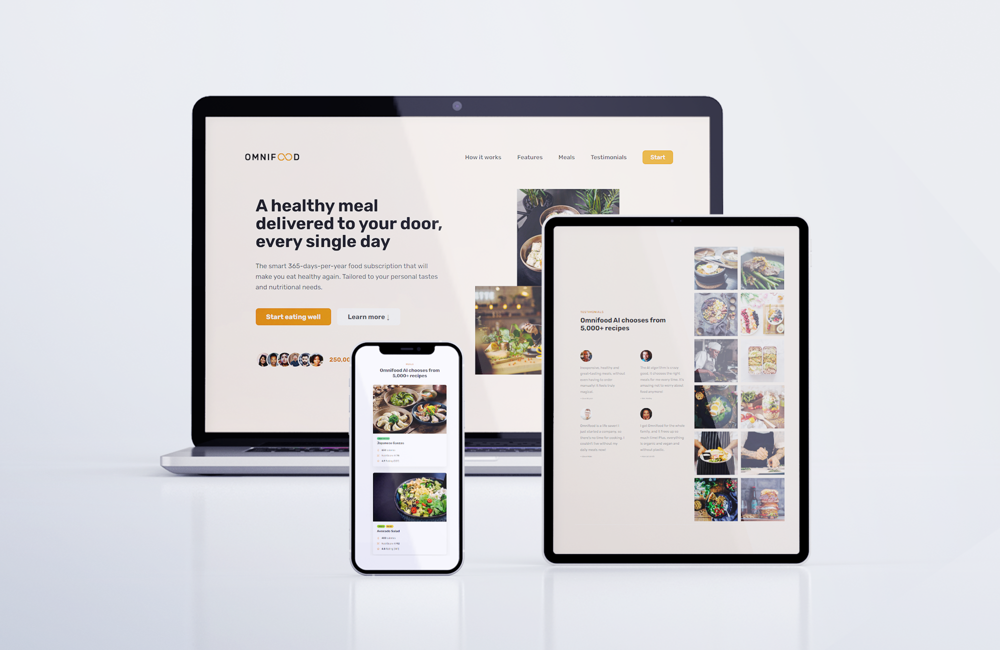

# EshopFoodCompany
Here's a demo: https://omnifood-eshop.netlify.app/
It's full responsive website.
I used the following tools:
- HTML 5(BEM)
- CSS 3
- Grid (layout) & Flexbox (blocks)
- JavaScript

This a webpage of a company that sells food in USA with annual membership.


## Installation
```sh
git clone https://github.com/stefanoMTdev/EshopFoodCompany.git
open index.html
```
